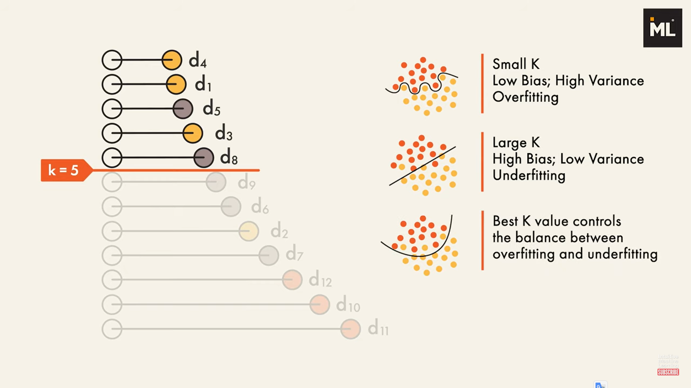
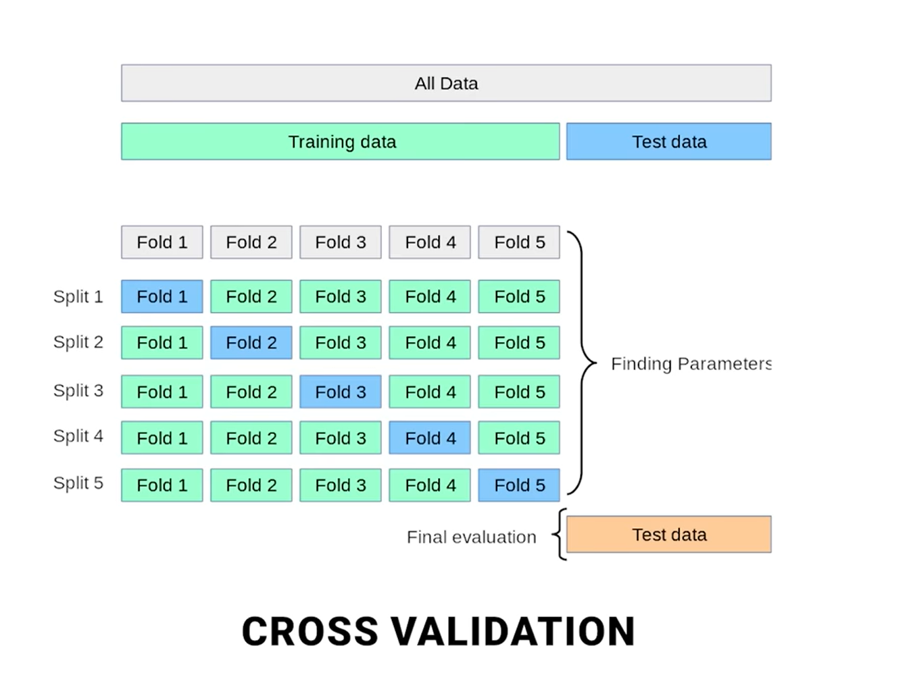

# KNN 

To evaluate the performance of a K-Nearest Neighbors (KNN) classifier, particularly for a multi-class classification problem like the Iris dataset, several metrics can be used. These metrics help in understanding how well the algorithm classifies new, unseen data.

Here are the key metrics:

1.  **Accuracy:**
    * **Definition:** The most straightforward metric, it measures the proportion of correctly classified instances (both true positives and true negatives) out of the total number of instances.
    * **Formula:** $\text{Accuracy} = \frac{\text{Number of Correct Predictions}}{\text{Total Number of Predictions}}$
    * **Use Case:** Good for balanced datasets where all classes have roughly the same number of samples.

2.  **Confusion Matrix:**
    * **Definition:** A table that visualizes the performance of a classification algorithm. Each row represents the instances in an actual class, while each column represents the instances in a predicted class.
    * **Components for Binary Classification:**
        * **True Positives (TP):** Correctly predicted positive cases.
        * **True Negatives (TN):** Correctly predicted negative cases.
        * **False Positives (FP):** Incorrectly predicted positive cases (Type I error).
        * **False Negatives (FN):** Incorrectly predicted negative cases (Type II error).
    * **Use Case:** Provides a detailed breakdown of correct and incorrect classifications for each class, which is crucial for understanding specific types of errors.

3.  **Precision:**
    * **Definition:** Measures the proportion of true positive predictions among all instances predicted as positive. It answers: "Of all instances predicted as positive, how many were actually positive?"
    * **Formula:** $\text{Precision} = \frac{\text{TP}}{\text{TP} + \text{FP}}$
    * **Use Case:** Important when the cost of a false positive is high (e.g., spam detection, medical diagnosis where a false alarm can cause unnecessary stress).

4.  **Recall (Sensitivity or True Positive Rate):**
    * **Definition:** Measures the proportion of true positive predictions among all actual positive instances. It answers: "Of all actual positive instances, how many did the model correctly identify?"
    * **Formula:** $\text{Recall} = \frac{\text{TP}}{\text{TP} + \text{FN}}$
    * **Use Case:** Important when the cost of a false negative is high (e.g., disease detection, fraud detection, where missing a positive case has severe consequences).

5.  **F1-Score:**
    * **Definition:** The harmonic mean of Precision and Recall. It provides a single score that balances both precision and recall.
    * **Formula:** $\text{F1-Score} = 2 \times \frac{\text{Precision} \times \text{Recall}}{\text{Precision} + \text{Recall}}$
    * **Use Case:** Particularly useful when dealing with imbalanced datasets, where a simple accuracy score might be misleading.

6.  **Classification Report:**
    * **Definition:** A summary report provided by libraries like scikit-learn that includes precision, recall, F1-score, and support (number of actual occurrences of the class in the specified dataset) for each class. It also often includes macro average and weighted average.
    * **Use Case:** A convenient way to get a quick overview of all the per-class metrics.

7.  **ROC Curve and AUC (Area Under the Receiver Operating Characteristic Curve):**
    * **Definition:** Primarily used for binary classification, the ROC curve plots the True Positive Rate (Recall) against the False Positive Rate at various threshold settings. AUC quantifies the overall performance, indicating the probability that the classifier will rank a randomly chosen positive instance higher than a randomly chosen negative instance.
    * **Use Case:** Useful for understanding the trade-off between sensitivity and specificity, and for comparing different models. For multi-class, it can be extended using one-vs-rest (OvR) or one-vs-one (OvO) approaches.

**Important Considerations for Evaluation:**

* **Train-Test Split/Cross-Validation:** Always split your dataset into training and testing sets (or use cross-validation) to evaluate the model's performance on unseen data. Evaluating solely on the training data can lead to an overly optimistic (and often misleading) view of performance, especially with algorithms like KNN that can easily overfit if $k$ is too small.
* **Choice of $k$:** As you've seen in the visualizations, the choice of the 'k' parameter significantly impacts the decision boundary and, consequently, the performance. 

**Cross-validation** is often used to find the optimal $k$ for a given dataset.

